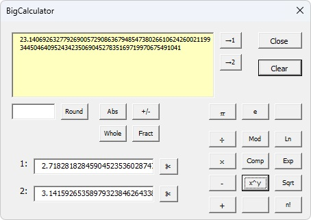

# BigDecimal Addin for VBA
BigDecimal is a high-performance, arbitrary-precision decimal library designed to break the 15-digit precision barrier of standard Excel calculations. Heavily inspired by the robust BigDecimal implementations found in enterprise languages like Java, this add-in brings industrial-grade numerical accuracy directly to your spreadsheets.

Whether you are performing complex financial reconciliations or deep scientific research, BigDecimal ensures that your results are never compromised by floating-point errors or rounding limitations.

To demonstrate the precision and performance of the underlying engine, this add-in includes BigCalculator—a standalone interactive interface built directly with Excel. This calculator allows users to perform real-time, arbitrary-precision calculations and experiment with the expanded scientific function suite without needing to write a single formula. It serves as a perfect "sandbox" to verify results and visualize the extreme decimal accuracy that BigDecimal provides before implementing it into your primary workbooks.

  

## Key Capabilities
1. Arbitrary Precision: Calculations are no longer restricted by standard 64-bit float constraints. Your precision is limited only by your system’s hardware and available memory.
2. Enterprise-Standard Logic: Mimics the reliable rounding modes and arithmetic behavior of the Java BigDecimal class, ensuring consistent results across different platforms.
3. Advanced Scientific Suite: Beyond standard arithmetic ($+$, $-$, $\times$, $\div$), the add-in includes an expanded library of scientific functions optimized for high-precision environments.
4. Native Excel Integration: Functions are exposed directly within an Excel Class, allowing you to use them as easily while maintaining extreme decimal accuracy.

## Why BigDecimal?
Standard Excel uses the IEEE 754 floating-point standard, which is excellent for speed but can introduce "silent" errors in very large or very small numbers. BigDecimal for Excel replaces this with an exact-value representation, allowing you to define the exact scale and precision required for your specific use case.
